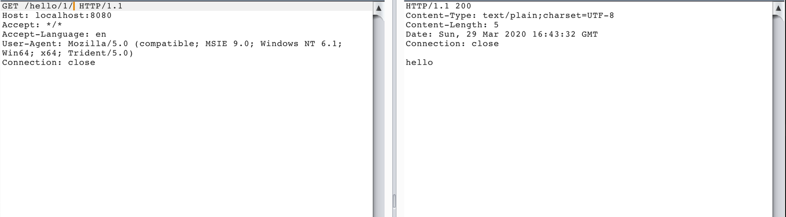
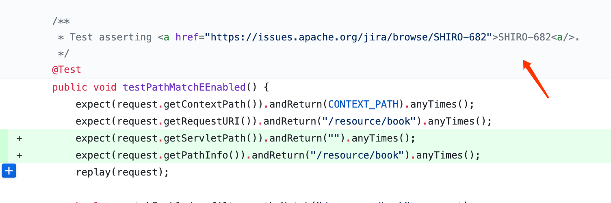
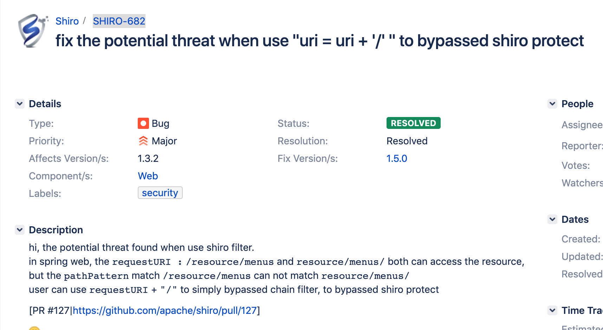
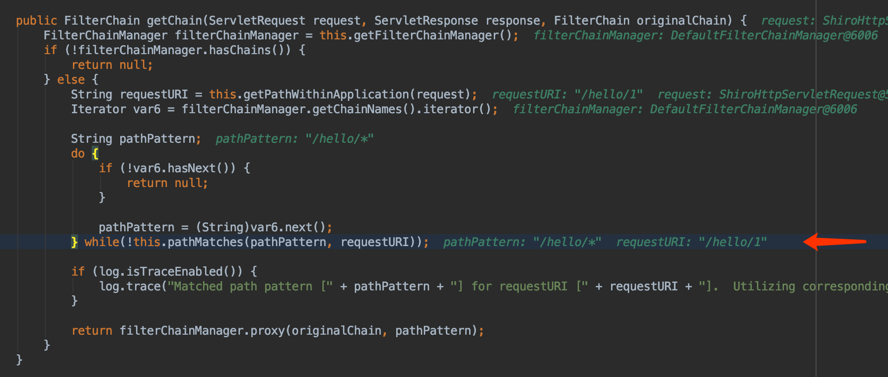
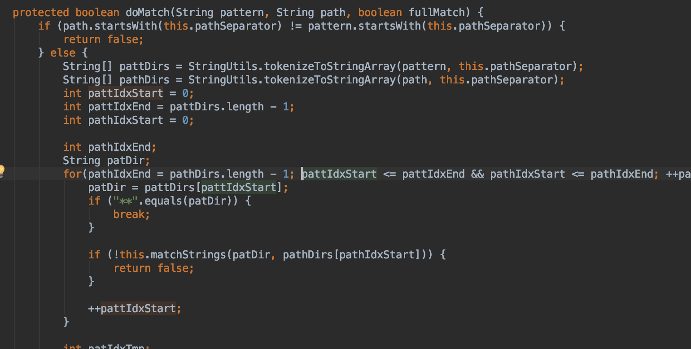

## Apache Shiro身份验证绕过漏洞（CVE-2020-1957） {docsify-ignore}

?> 编辑：[@r4v3zn](https://github.com/0nise)

?> 分析作者：斗像科技

### Payload

被拦截URL+`/`，利用截图如下：



### 概况

Apache Shiro是美国阿帕奇(Apache)软件基金会的一套用于执行认证、授权、加密和会话管理的 Java 安全框架。3月24日，Apache Shiro官方发布安全更新版本 1.5.2，修复了一个权限绕过漏洞(CVE-2020-1957)。

在Apache Shiro 1.5.3之前的版本，将Apache Shiro与Spring控制器一起使用时，特制请求可能会导致身份验证绕过。

### 影响版本

- Apache Shiro < 1.5.2

### 分析过程

#### Shiro拦截器

Shiro框架通过拦截器功能来实现对用户访问权限的控制和拦截。Shiro中常见的拦截器有anon,authc等拦截器。

1. anon为匿名拦截器，不需要登录就能访问，一般用于静态资源,或者移动端接口
2. authc为登录拦截器，需要登录认证才能访问的资源。

用户可以在Shiro.ini编写匹配URL配置，将会拦截匹配的URL，并执行响应的拦截器。从而实现对URL的访问控制，URL路径表达式通常为ANT格式。如下配置，访问 /index.html主页的时候，Shiro将不会对其进行登录判断，anon拦截器不需要登录就能进行访问。而对于/user/xiaoming 等 /user/xiaogang等接口，authc拦截器将会对其进行登录判断，有登录认证才能访问资源。

```java
[urls]
/index.html = anon
/user/** = authc
```

Shiro的URL路径表达式为Ant 格式，路径通配符支持 `?` `*` `**` 。

```java
?：匹配一个字符
*：匹配零个或多个字符串
**：匹配路径中的零个或多个路径
```

其中`*`表示匹配零个或多个字符串，`/*`可以匹配`/hello`，但匹配不到`/hello/`因为*通配符无法匹配路径。假设`/hello`接口设置了authc拦截器，访问`/hello`将会被进行权限判断，如果请求的URI为`/hello/`呢，`/*`URL路径表达式将无法正确匹配，放行。然后进入到spring(Servlet)拦截器，spring中`/hello` 形式和`/hello/`形式的URL访问的资源是一样的。

#### 技术细节

根据Shiro开发者在1.5.2版本中提交的[commit](https://github.com/apache/shiro/commit/3708d7907016bf2fa12691dff6ff0def1249b8ce)中关于PathMatchingFilter类的测试用例，可以直接关联到JIRA issue [SHIRO-682](https://issues.apache.org/jira/browse/SHIRO-682)，该issue在1.5.0版本中进行了修复。而1.5.2版本中更新则是对其绕过的修复。



SHIRO-682的修复了spring框架下uri = uri + ‘/’ 绕过Shiro防护的问题。然后下面的描述则清晰得描述了造成改错误的原因。

在 Spring web 项目中，请求URI `/resource/menus` 和`/resource/menus/` 都可以访问到服务器的资源。

但在Shiro中的URL路径表达式 pathPattern 可以正确匹配`/resource/menus`，但不能正确匹配`/resource/menus/`，导致过滤链无法正确匹配，从而绕Shiro的防护机制。



#### 漏洞成因

漏洞初始成因可以定位到 `PathMatchingFilterChainResolver` 的 `getChain` 函数下，该函数作用根据URL路径匹配中配置的 url 路径表达式来匹配输入的URL，判断是否匹配拦截器，匹配成功将会返回响应的拦截器执行链，让 ShiroFither 执行权限操作的。

其对于 URL 路径表达式和输入 URL 的匹配主要通过 `pathMathches` 函数进行匹配。



`pathMatches` 函数其最终会调用 `shiro.util.AntPathMatcher` 类中 `doMatch` 的对于 `ant` 格式的 `pathPattern` 和 `requestURI` 进行匹配。

```java
//pathMatches:135, PathMatchingFilterChainResolver (org.apache.shiro.web.filter.mgt)
protected boolean pathMatches(String pattern, String path) {
        PatternMatcher pathMatcher = this.getPathMatcher();
        return pathMatcher.matches(pattern, path);
}
```

doMatch:109, `AntPathMatcher (org.apache.shiro.util)`，当 Shiro 的 Ant 格式的 `pathPattern` 中的的`*`通配符是不支持匹配路径的，所以`/hello/*` 不能成功匹配`/hello/1/` ，也就不会触发authc拦截器进行权限拦截。从而成功绕过了 Shiro 拦截器，而后再进入到 spring 拦截器中，/hello/1/ 与`/hello/1`能获取到相同的资源。



### 靶场

靶场环境：`docker pull vulfocus/shiro-cve_2020_1957`

### 修复

升级至最新版本：http://shiro.apache.org/download.html

### 分析文章

- [shiro-权限绕过漏洞分析（cve-2020-1957）](https://blog.riskivy.com/shiro-权限绕过漏洞分析（cve-2020-1957）/)  斗像科技
- [Shiro 权限绕过漏洞分析(CVE-2020-1957)](https://paper.seebug.org/1196/) Spoock

